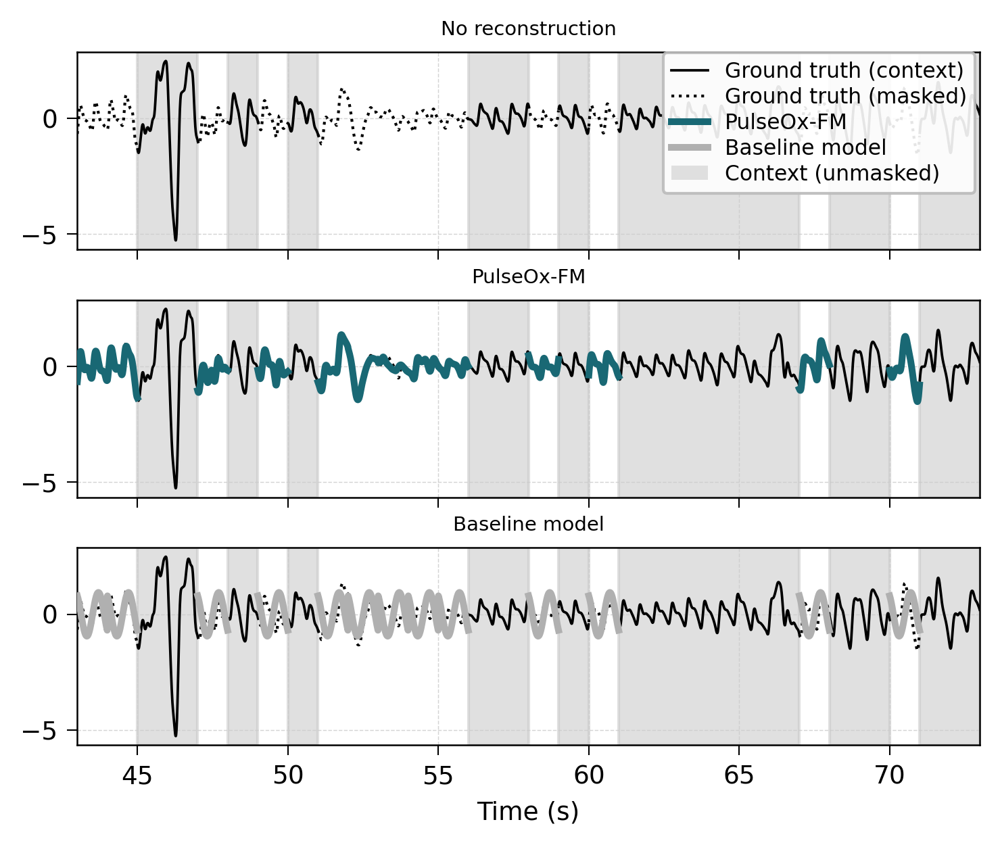
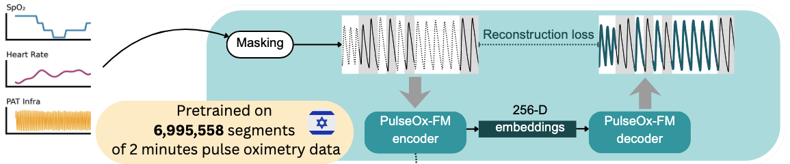

# SleepFM — Self-supervised Learning for Useful Representations of Raw Sleep Signals

> **Paper:** [Title TBD] — link to arXiv / DOI coming soon
>
> **Pretrained weights:** Coming soon on HuggingFace

---



## Overview

SleepFM is a self-supervised foundation model that learns compact 256-dimensional representations from overnight pulse oximetry (PPG) recordings. It is pretrained using a **Masked Autoencoder (MAE)** objective on a Vision Transformer backbone adapted for 1D time-series — no labels required.

Pretrained on **6,995,558** two-minute PPG segments from the HPP sleep cohort, the model learns embeddings that encode physiologically meaningful information and generalise to downstream clinical prediction tasks (metabolic health, sleep quality, cardiovascular risk, medication use) as well as out-of-distribution surgical monitoring data (VitalDB).

---

## Architecture



**Key numbers**

| Property | Value |
|---|---|
| Sampling rate | 125 Hz |
| Segment length | 120 s (15 000 samples) |
| Input channels | 3 (SpO₂, HR, PAT waveform) |
| Patch size | 125 samples (1 s) → 120 patches |
| Encoder depth / heads | 24 / 16 |
| Decoder depth / heads | 8 / 16 |
| Embedding dimension | 256 (CLS token) |
| Mask ratio (pretraining) | 50 % |
| Pretraining corpus | 6,995,558 segments |
| Total parameters | ~40 M |

---

## Repository Structure

```
PulseOx-FM/
├── smoke_test.py              One-command forward-pass verification
├── requirements.txt
│
├── model/
│   ├── __init__.py            Exposes MaskedAutoencoderViT & MAE1DViT
│   ├── architecture/
│   │   ├── mae_vit.py         MaskedAutoencoderViT (2-D) and MAE1DViT (1-D, paper model)
│   │   └── util/              Positional embeddings, patch embeddings, distributed helpers
│   ├── data/
│   │   ├── datasets.py        PyTorch Dataset: segment loading, z-score normalisation
│   │   └── preprocessing.py   pyPPG pipeline: filtering, 125 Hz resampling, segmentation
│   ├── training/
│   │   ├── train.py           Full MAE pretraining loop (multi-GPU, wandb logging)
│   │   └── util/              LR schedule and layer-wise LR decay
│   ├── inference/
│   │   └── extract_embeddings.py  Load checkpoint → HDF5 / CSV of 256-dim embeddings
│   └── utils.py               Shared path and utility helpers
│
├── downstream/
│   └── reconstruction.py      MAE reconstruction quality evaluation (raw signal)
│
├── plotting/
│   ├── make_all_figures.py    Generates all manuscript figures from pre-computed results
│   ├── figure_2/              Signal reconstruction figures
│   ├── figure_3/              External dataset (VitalDB) figures
│   ├── figure_3b/             Temporal age-prediction figures
│   ├── figure_4/              Clinical target prediction figures
│   ├── figure_5/              Next-day metabolic association figures
│   ├── figure_6/              Within-person variability figures
│   └── extended_data/         Ablation study figures
│
├── figures/                   Publication-ready PDF/PNG for all manuscript figures
│
├── results/
│   ├── Table_1.csv            Main results table
│   ├── Supplementary_Table_*.csv
│   ├── target_prediction/     Per-target AUC and Pearson-r CSVs
│   └── *.json                 Numerical data powering each figure
│
└── sample_data/
    └── example_ppg.npy        Synthetic 120 s × 3-channel recording (1, 3, 15000)
```

---

## Setup

```bash
git clone https://github.com/<org>/PulseOx-FM.git
cd PulseOx-FM
pip install -r requirements.txt
```

> Requires Python ≥ 3.9 and `timm==0.5.4` (pinned — the ViT block API changed in later versions).

---

## Quick Start — Smoke Test

Run a single forward pass with the bundled synthetic recording:

```bash
python smoke_test.py
```

Expected output:

```
Device: cpu
Building model…
  Parameters: ~40,000,000
Running forward pass  (mask_ratio=0.5)…

── Results ──────────────────────────────────────────────────────
  Embedding shape : (1, 256)
  Embedding norm  : ...
  Reconstruction loss : ...
  Pred patches shape  : (1, 60, 375)
  Masked patches      : 60 / 120

Smoke test passed.
```

**With a pretrained checkpoint:**

```bash
python smoke_test.py --checkpoint path/to/weights.pth
```

**With your own recording:**

```bash
python smoke_test.py --input path/to/recording.npy
# file must be a float32 numpy array of shape (1, 3, 15000)
```

---

## Pretrained Weights

Coming soon on HuggingFace. The checkpoint will be loadable with:

```python
from model.architecture.mae_vit import MAE1DViT
from functools import partial
import torch.nn as nn

model = MAE1DViT(
    in_chans=3, input_size=15_000, patch_size=125,
    embed_dim=256, decoder_embed_dim=256,
    depth=24, num_heads=16, decoder_num_heads=16,
    mlp_ratio=4, norm_layer=partial(nn.LayerNorm, eps=1e-6),
    loss_version="v3.3", loss_channels=[2],
)
state = torch.load("weights.pth", map_location="cpu")
model.load_state_dict(state["model"], strict=False)
model.eval()
```

---

## Extracting Embeddings

```python
import numpy as np, torch
from functools import partial
import torch.nn as nn
from model.architecture.mae_vit import MAE1DViT

model = MAE1DViT(
    in_chans=3, input_size=15_000, patch_size=125,
    embed_dim=256, decoder_embed_dim=256,
    depth=24, num_heads=16, decoder_num_heads=16,
    mlp_ratio=4, norm_layer=partial(nn.LayerNorm, eps=1e-6),
    loss_version="v3.3", loss_channels=[2],
).eval()

x = torch.from_numpy(np.load("sample_data/example_ppg.npy"))  # (1, 3, 15000)
with torch.no_grad():
    _, _, _, _, latent, *_ = model(x, mask_ratio=0.5)
embedding = latent[:, 0, :]  # CLS token → (1, 256)
print(embedding.shape)       # torch.Size([1, 256])
```

---

## Training

```bash
python -m model.training.train --help
```

Pretraining uses the `MAE1d_on_segments` configuration:
- 120 s segments at 125 Hz
- Random 50 % masking
- AdamW, base LR 1e-3, cosine schedule, 400 epochs
- Weighted DTW + MSE loss on the PAT waveform channel

---

## Reproducing Figures

All plotting scripts read from pre-computed result files in `results/` — no patient data required.

```bash
python plotting/figure_2/make_figure.py    # Signal reconstruction quality
python plotting/figure_3/make_figure.py    # External dataset (VitalDB) evaluation
python plotting/figure_3b/make_figure.py   # Temporal age prediction
python plotting/figure_4/make_figure.py    # Clinical target prediction
python plotting/figure_5/make_figure.py    # Next-day metabolic associations
python plotting/figure_6/make_figure.py    # Within-person variability
python plotting/extended_data/make_ablation.py  # Ablation study (Extended Data Fig. 4)
```

Rendered figures (PDF + PNG) are also committed directly to `figures/`.

---

## Results

Pre-computed result files are in `results/`. Key files:

| File | Contents |
|---|---|
| `Table_1.csv` | Main results table |
| `target_prediction/regression_target_prediction_summary.csv` | Pearson r for continuous targets |
| `target_prediction/classification_binary_targets_AUC.csv` | AUROC for disease classification |
| `target_prediction/classification_binary_medications_AUC.csv` | AUROC for medication prediction |
| `target_prediction/grouped_incidence_or_results.csv` | Disease incidence odds ratios |
| `signal_reconstructions.json` | Forecasting and reconstruction metrics |
| `temporal_age_prediction.json` | Age prediction across time horizons |
| `external_datasets.json` | VitalDB out-of-distribution evaluation |
| `ablation.json` | Masking ratio, patch size, epoch ablations |

---

## Citation

```bibtex
@article{sleepfm2025,
  title   = {[Title TBD]},
  author  = {[Authors TBD]},
  journal = {[Journal TBD]},
  year    = {2025},
}
```

---

## License

See [LICENSE](LICENSE).
