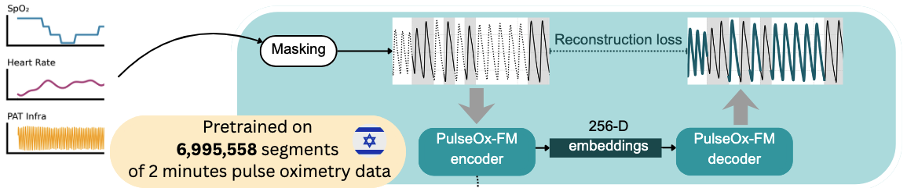
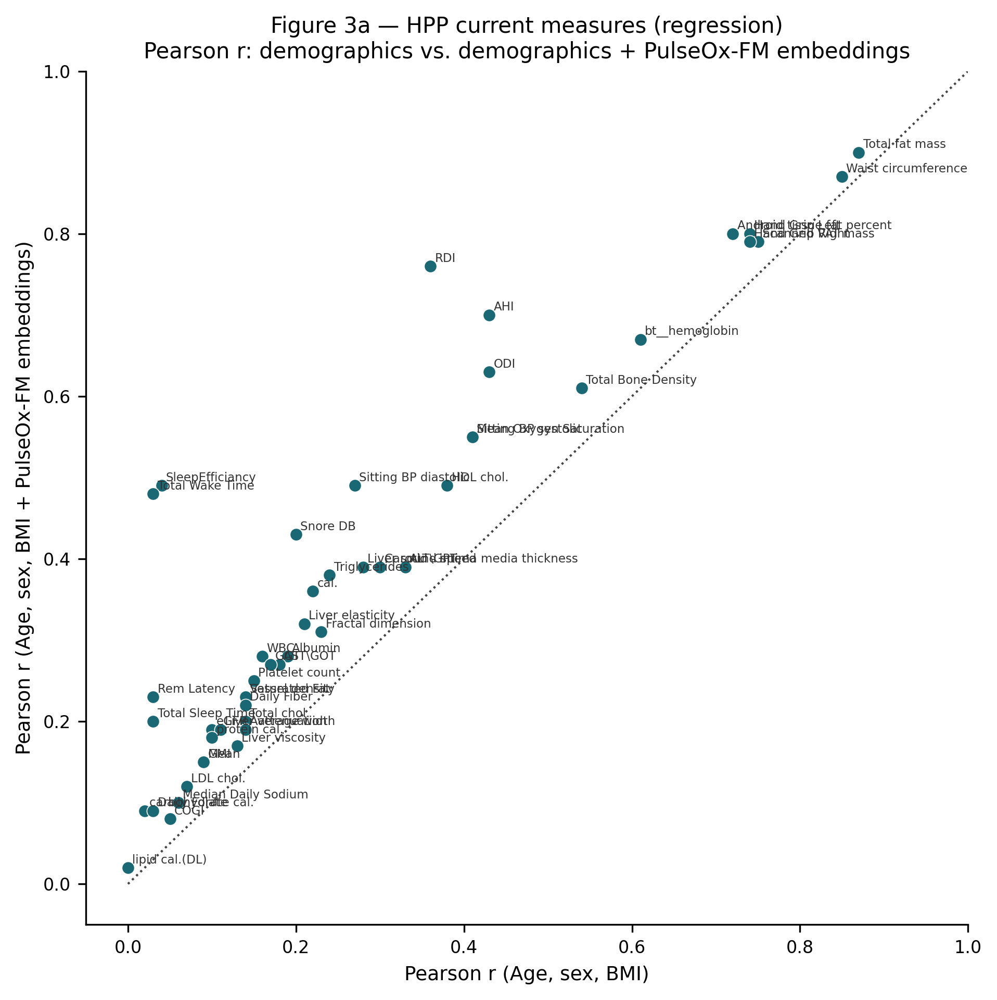

# PulseOx-FM

**A foundation model of wearable pulse oximetry reveals physiological signatures of health and cardiometabolic risk**

Kohn et al.



## Overview

PulseOx-FM is a self-supervised foundation model that learns compact 256-dimensional representations from overnight pulse oximetry (PPG) recordings. It is pretrained using a **Masked Autoencoder (MAE)** objective on a Vision Transformer backbone adapted for 1D time-series — no labels required.

Pretrained on **6,995,558** two-minute PPG segments from the HPP sleep cohort, the model learns embeddings that encode physiologically meaningful information and generalise to downstream clinical prediction tasks (metabolic health, sleep quality, cardiovascular risk, medication use) as well as out-of-distribution surgical monitoring data (VitalDB).

This repository provides the **model architecture** and **training code** so that researchers can train PulseOx-FM from scratch on their own data, together with the **aggregate results** and **standalone code** needed to reproduce the manuscript's downstream-association figures.

---

## Architecture

**Key numbers**

| Property | Value                           |
|---|---------------------------------|
| Sampling rate | 125 Hz                          |
| Segment length | 120 s (15 000 samples)          |
| Input channels | 3 (SpO₂, HR, PPG waveform)      |
| Patch size | 125 samples (1 s) → 120 patches |
| Encoder depth / heads | 24 / 16                         |
| Decoder depth / heads | 8 / 16                          |
| Embedding dimension | 256 (CLS token)                 |
| Mask ratio (pretraining) | 50 %                            |
| Pretraining corpus | 6,995,558 segments              |
| Total parameters | ~26.8 M                         |

---

## Repository Structure

```
PulseOx-FM/
├── README.md
├── LICENSE
├── requirements.txt
│
├── model/
│   ├── __init__.py            Exposes MaskedAutoencoderViT
│   ├── architecture/
│   │   ├── mae_vit.py         MAE1DViT (1-D, paper model) and MaskedAutoencoderViT (2-D)
│   │   └── util/              Positional embeddings, patch embeddings, distributed helpers
│   ├── data/
│   │   ├── datasets.py        PyTorch Dataset: segment loading, z-score normalisation
│   │   └── preprocessing.py   pyPPG pipeline: filtering, 125 Hz resampling, segmentation
│   ├── training/
│   │   ├── train.py           Full MAE pretraining loop (multi-GPU, wandb logging)
│   │   └── util/              LR schedule and layer-wise LR decay
│   └── utils.py               Shared path and utility helpers
│
├── downstream/
│   └── reconstruction.py      MAE reconstruction-quality evaluation (used during training)
│
├── plotting/
│   ├── figure_3/make_figure.py   Reproduces manuscript Figure 3 from Supplementary Table 4
│   └── figure_4/make_figure.py   Reproduces manuscript Figure 4b from Supplementary Table 5
│
├── results/
│   ├── Table_1.csv                  Cohort characteristics
│   └── Supplementary_Table_1..5.csv Aggregate, de-identified downstream results
│
├── figures/
│   ├── Figure 3.pdf / .png          Manuscript figures (reference)
│   ├── Figure 4.pdf / .png
│   └── Figure_3_reproduced.*, Figure_4b_reproduced.*   (generated by the scripts above)
│
├── assets/                    README images
│
└── sample_data/
    ├── example_ppg.npy        Synthetic 120 s × 3-channel recording (1, 3, 15000)
    └── make_example.py        Regenerates the synthetic example
```

---

## Setup

```bash
git clone https://github.com/SarahKohn/PulseOx-FM.git
cd PulseOx-FM
pip install -r requirements.txt
```

> Requires Python ≥ 3.9 and `timm==0.5.4` (pinned — the ViT block API changed in later versions).

---

## Training

The architecture is provided so you can pretrain PulseOx-FM on your **own** PPG data. No pretrained weights are required or distributed.

```bash
python -m model.training.train --help
```

Pretraining uses the `MAE1d_on_segments` configuration:

- 120 s segments at 125 Hz
- Random 50 % masking
- AdamW, base LR 1e-3, cosine schedule, 400 epochs
- Weighted DTW + MSE loss on the PAT waveform channel

To prepare data, see `model/data/preprocessing.py` (pyPPG filtering, 125 Hz resampling, segmentation) and `model/data/datasets.py` (segment loading and z-score normalisation). A synthetic example segment of the expected shape `(1, 3, 15000)` is provided in `sample_data/example_ppg.npy`; it is generated entirely from deterministic noise and sinusoids (`sample_data/make_example.py`) and is **not** derived from any human cohort.

---

## Downstream health associations

This section reproduces the manuscript's downstream-association figures (Figure 3 and Figure 4b) directly from the aggregate, de-identified result tables shipped in `results/`. The plotting scripts read only those summary tables.

```bash
python plotting/figure_3/make_figure.py    # Figure 3  ← results/Supplementary_Table_4.csv
python plotting/figure_4/make_figure.py    # Figure 4b ← results/Supplementary_Table_5.csv
```

Each script writes `Figure_3_reproduced.{pdf,png}` / `Figure_4b_reproduced.{pdf,png}` into `figures/` (override with `--outdir`). The original manuscript renders are committed alongside as `figures/Figure 3.*` and `figures/Figure 4.*` for reference.

- **Figure 3** — PulseOx-FM embeddings improve clinical target prediction over a demographics-only baseline (age, sex, BMI): regression of current measures (panel a), classification of current diagnoses and medication intake (panel b), and out-of-distribution VitalDB pre-operative diagnoses/measures (panel c).
- **Figure 4b** — Next-day metabolic associations: next-day CGM, food-log and wearable targets predicted from sleep architecture vs. sleep architecture + PulseOx-FM embeddings.

> **Figure 4a** (the within-/between-person embedding-distance histogram) requires per-recording embeddings, which are not distributed with this repository, and is therefore not reproduced here.

### Results

**Figure 3a — Current measures (regression)**

PulseOx-FM embeddings improve prediction of current physiological measures over a demographics-only baseline (age, sex, BMI). Each point is one target; points above the identity line are better predicted with embeddings. Reproduce with `python plotting/figure_3/make_figure.py`.



**Result tables in `results/`**

| File | Contents |
|---|---|
| `Table_1.csv` | Cohort characteristics (HPP train/val, HPP test, VitalDB) |
| `Supplementary_Table_1.csv` | Medication-category prevalence in the HPP sleep cohort |
| `Supplementary_Table_2.csv` | Disease-category prevalence in the HPP sleep cohort |
| `Supplementary_Table_3.csv` | Age-prediction performance across cohorts and feature sets |
| `Supplementary_Table_4.csv` | Per-target prediction metrics (demographics vs. + embeddings) — **source for Figure 3** |
| `Supplementary_Table_5.csv` | Next-day metabolic associations (CGM / food / wearables) — **source for Figure 4b** |

All result files are aggregate, per-target summaries containing no participant-level data.

---

## Citation

```bibtex
@article{kohn2025pulseoxfm,
  title   = {A foundation model of wearable pulse oximetry reveals physiological signatures of health and cardiometabolic risk},
  author  = {Kohn, Sarah and Lutsker, Guy and Diament, Alon and Shilo, Smadar and Gabet, Adam and Sasson, Gil and Wolf, Gili and Wolf, Adva and Godneva, Anastasia and Weinberger, Adina and Rossman, Hagai and Segal, Eran},
  journal = {arXiv},
  year    = {2026},
}
```

---

## License

See [LICENSE](LICENSE).
